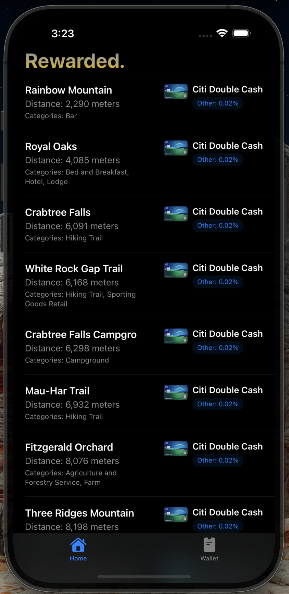
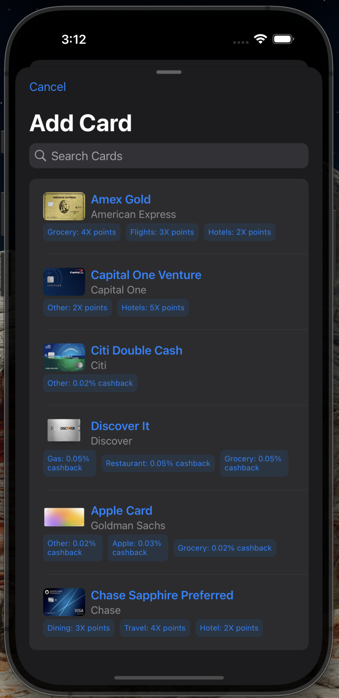
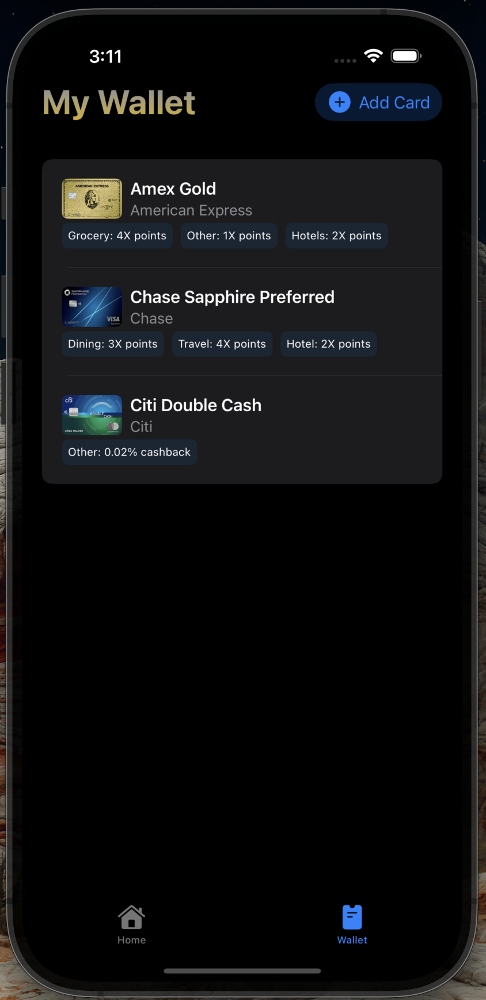

# 💳 Rewarded.

***Rewarded.*** is a geolocation-based iOS app that recommends the best credit card to use at nearby businesses based on your wallet and nearby business's category. The goal is to help users maximize their credit card rewards (cash back or points). 

---

## 📸 Screenshots / Videos

| Home View | Add Card | Wallet |
|----------------|-----------|--------|
|  |  |  |

---

## Purpose

***Rewarded.*** helps users choose where to bring their business to maximize their credit card rewards, with convenience and an intuitive design at the heart of the app. 

***Say*** you're at a shopping center for an appointment and want to grab a cup of coffee. Odds are, you have more than a few choices near you. ***Rewarded.*** provides you with up-to-date information to make the best financially-informed decision for you. 

---

## Tools & Technologies

- **SwiftUI** – Manage UI with views
- **SwiftData** – Enable persistent local storage (after app close)
- **CoreLocation** – Fetching user location
- **Foursquare Places API** – Business discovery by location
- **Xcode + iOS Simulator** – Development environment

---

## Features

✅ Modular SwiftUI components  

✅ Onboarding welcome screen with pleasing animations

✅ Browse available cards and add to wallet 

✅ Real-time geolocation-based business list (sorted by distance)  

✅ Reward matching logic for best card recommendations depending on business category 

✅ Swipe-to-refresh and dynamic location updates  

✅ Local SwiftData persistence  

---

## Challenges & Lessons Learned

- Fetching location using CoreLocation and managing async updates without duplication of state/value
- Backend logic matching business categories with various card reward categories  
- Ordering and applying animations and transitions for a smooth and seamless experience
- Determing when to use `@Query`, `@State`, `@ObservedObject`, and `@Binding` properties to manage dynamic updates from different areas of app  
- Feeding location results to FourSquare Places API and making REST calls in a reactive UI loop  

---

## Future Goals

- Accesibility support
- Add a settings tab to allow the user to:

  Choose units of display (miles, kilometers, etc.)

  Set distance radius (search for businesses within 1 mile, 5 miles, etc.)
- MapView of nearby businesses
- Add a detailed BusinessItemView for each business within user's location radius:

  View photo/logo of the business (fetching from API)

  View location (map view relative to user location)

  View rating of business (from yelp or google maps)

  View rewards for all cards in wallet at each business with applicable rewards categories highlighted
- Add support for more cards and dynamically fetching rewards categories/values

  Fetch rotating offers for cards and display offer if matched to business
- More rigorous reward calculation for loosely defined categories

  For example, a category of type 'Coffee Shop' should also be recognized as a Restaurant
- Polish UI flow

  Allow user to create account

  Polish welcome screen

  Allow user to filter types of businesses displayed

